# 포팅 매뉴얼

## 목차
1. [개발 환경](#1-개발-환경)
2. [Backend 설정 및 실행](#2-backend-설정-및-실행)
3. [Frontend 설정 및 실행](#3-frontend-설정-및-실행)
4. [Admin Frontend 설정 및 실행](#4-admin-frontend-설정-및-실행)
5. [Nginx 설정 및 실행](#5-nginx-설정-및-실행)
6. [Infrastructure 설정](#6-infrastructure-설정)
7. [Docker Compose를 이용한 인프라 구축](#7-docker-compose를-이용한-인프라-구축)
8. [Jenkins CI/CD 파이프라인](#8-jenkins-cicd-파이프라인)
9. [포트 정리](#9-포트-정리)
10. [트러블슈팅](#10-트러블슈팅)
11. [로봇 시뮬레이터 (테스트용)](#11-로봇-시뮬레이터-테스트용)
12. [추가 정보](#12-추가-정보)
13. [시나리오](#13-시나리오)

---

## 1. 개발 환경

### 1.1 Backend (Spring Boot)

**필수 소프트웨어**
- IDE: IntelliJ IDEA (권장)
- Java: JDK 17
- Spring Boot: 3.5.10
- Gradle: 8.14.3
- Build Tool: Gradle Wrapper (프로젝트에 포함)

**주요 의존성 및 버전**
- Spring Framework
  - spring-boot-starter-web
  - spring-boot-starter-validation
  - spring-boot-starter-data-jpa
  - spring-boot-starter-data-redis
  - spring-boot-starter-integration
  - spring-boot-starter-webflux
  - spring-boot-starter-aop
  - spring-retry

- Database & Cache
  - MySQL Connector: com.mysql:mysql-connector-j (latest)
  - Redis: spring-boot-starter-data-redis

- MQTT
  - Spring Integration MQTT: spring-integration-mqtt
  - Eclipse Paho MQTT Client: 1.2.5

- Security & Authentication
  - JWT (jjwt): 0.11.5 (api, impl, jackson)
  - BCrypt: jbcrypt 0.4

- Utilities
  - Lombok: (latest via annotation processor)
  - Spring Dotenv: 4.0.0

- Testing
  - Spring Boot Starter Test
  - Testcontainers (JUnit Jupiter, MySQL, Redis 2.2.2)
  - Awaitility: 4.2.0

**Runtime**
- JRE: Eclipse Temurin 17

---

### 1.2 Frontend (사용자용)

**필수 소프트웨어**
- IDE: Visual Studio Code (권장)
- Node.js: 20.x (LTS)
- Package Manager: npm
- Build Tool: Vite 7.2.4

**주요 의존성 및 버전**
- React & Core
  - React: 19.2.0
  - React DOM: 19.2.0
  - React Router DOM: 7.13.0
  - TypeScript: 5.9.3

- UI & Styling
  - Tailwind CSS: 4.1.18
  - @tailwindcss/postcss: 4.1.18
  - Framer Motion: 12.29.2
  - Lucide React: 0.563.0
  - Radix UI Components (checkbox, dialog, separator, slot, tabs)
  - Class Variance Authority: 0.7.1
  - clsx: 2.1.1
  - tailwind-merge: 3.4.0

- State Management & Data Fetching
  - Zustand: 5.0.10
  - TanStack React Query: 5.90.20
  - Axios: 1.13.2

- Forms & Validation
  - React Hook Form: 7.71.1
  - @hookform/resolvers: 5.2.2
  - Zod: 4.3.6

- Other Features
  - JWT Decode: 4.0.0
  - React Webcam: 7.2.0
  - @microsoft/fetch-event-source: 2.0.1
  - event-source-polyfill: 1.0.31

**DevDependencies**
- @vitejs/plugin-react: 5.1.1
- ESLint: 9.39.1
- TypeScript ESLint: 8.46.4
- PostCSS: 8.5.6
- Autoprefixer: 10.4.23

---

### 1.3 Admin Frontend (관리자용)

**필수 소프트웨어**
- IDE: Visual Studio Code (권장)
- Node.js: 20.x (LTS)
- Package Manager: npm
- Build Tool: Vite 6.0.0

**주요 의존성 및 버전**
- React & Core
  - React: 19.0.0
  - React DOM: 19.0.0
  - React Router DOM: 7.0.0
  - TypeScript: 5.7.0

- UI & Styling
  - Tailwind CSS: 4.0.0
  - @tailwindcss/vite: 4.0.0
  - Framer Motion: 12.29.2
  - Lucide React: 0.468.0
  - Class Variance Authority: 0.7.0
  - clsx: 2.1.0
  - tailwind-merge: 2.6.0

- 3D Graphics
  - Three.js: 0.182.0
  - @react-three/fiber: 9.5.0
  - @react-three/drei: 10.7.7

- State Management & Data
  - Zustand: 5.0.0
  - Axios: 1.7.0
  - @microsoft/fetch-event-source: 2.0.1

- Forms & Validation
  - React Hook Form: 7.54.0
  - @hookform/resolvers: 3.9.0
  - Zod: 3.23.0

- Notifications
  - React Toastify: 11.0.5

**DevDependencies**
- @vitejs/plugin-react: 4.3.0
- ESLint: 9.17.0
- TypeScript ESLint: 8.18.0

---

### 1.4 Nginx (웹 서버 & 리버스 프록시)

**환경**
- Base Image: nginx:alpine (latest)
- SSL/TLS: TLS 1.2, TLS 1.3
- Let's Encrypt (SSL 인증서)

**기능**
- HTTP to HTTPS 리다이렉션
- 정적 파일 서빙 (React 빌드 결과물)
- 리버스 프록시 (Backend API, Jenkins)
- SSE (Server-Sent Events) 지원
- Blue-Green 배포 지원

---

### 1.5 Infrastructure

**데이터베이스**
- MySQL: 8.0
  - Driver: com.mysql.cj.jdbc.Driver
  - Port: 3306 (내부), 외부 노출 안 함

**캐시**
- Redis: 7-alpine
  - Port: 6379 (내부), 외부 노출 안 함

**메시지 브로커**
- MQTT Broker (Mosquitto): 2.x
  - Protocol: TCP
  - Port: 1883 (내부), 8030 (외부 접근)

**컨테이너화**
- Docker
- Docker Compose

**CI/CD**
- Jenkins

**기타**
- OCR Server: 별도 서버 (Port 8020)
- Mattermost Webhook (알림용)

---

## 2. Backend 설정 및 실행

### 2.1 환경 변수 설정

Backend는 `spring-dotenv` 라이브러리를 사용하여 `.env` 파일로부터 환경 변수를 로드합니다.

`backend/.env` 파일을 생성하고 다음 내용을 작성하세요:

```bash
# Database 설정
DB_HOST=localhost
DB_PORT=3306
DB_NAME=carryporter
DB_USER=root
DB_PASS=your_password

# Redis 설정
REDIS_HOST=localhost
REDIS_PORT=6379

# MQTT 설정
MQTT_HOST=localhost
MQTT_PORT=1883
MQTT_USER=e101
MQTT_PASS=your_mqtt_password
MQTT_CLIENT_ID=carryporter-client

# JWT 설정
JWT_SECRET=your_base64_encoded_secret_key
JWT_EXPIRATION_TIME=86400000
JWT_REFRESH_EXPIRATION_TIME=86400000

# OCR Server 설정
OCR_SERVER_URL=http://localhost:8020

# Mattermost 웹훅 URL (알림용)
MM_WEBHOOK_URL=https://your-mattermost-url/hooks/your_webhook_id

# JPA 설정
JPA_DDL_AUTO=update
JPA_SHOW_SQL=true

# Context Path (선택사항)
CONTEXT_PATH=/api
```

**프로덕션 환경 (Docker)**:
- Docker 네트워크를 사용하는 경우 호스트명을 컨테이너 이름으로 변경
  - `DB_HOST=mysql`
  - `REDIS_HOST=redis`
  - `MQTT_HOST=mosquitto`

### 2.2 데이터베이스 준비

MySQL 데이터베이스를 생성합니다:

```sql
CREATE DATABASE carryporter CHARACTER SET utf8mb4 COLLATE utf8mb4_unicode_ci;
```

### 2.3 실행 방법

#### 개발 환경에서 실행 (IntelliJ IDEA)

1. IntelliJ IDEA에서 프로젝트를 엽니다
2. Gradle 의존성을 자동으로 다운로드합니다
3. `src/main/java/com/e101/carryporter/CarryporterApplication.java` 파일을 찾습니다
4. main 메서드 왼쪽의 실행 버튼을 클릭하거나 `Shift + F10`을 눌러 실행합니다

#### Gradle 명령어로 실행

```bash
# Windows
cd backend
.\gradlew.bat bootRun

# Linux/Mac
cd backend
./gradlew bootRun
```

#### JAR 파일 빌드 및 실행

```bash
# Windows
cd backend
.\gradlew.bat clean build
java -jar build/libs/carryporter-0.0.1-SNAPSHOT.jar

# Linux/Mac
cd backend
./gradlew clean build
java -jar build/libs/carryporter-0.0.1-SNAPSHOT.jar
```

### 2.4 테스트 실행

```bash
# Windows
.\gradlew.bat test

# Linux/Mac
./gradlew test
```

### 2.5 접속 확인

- API 기본 URL: `http://localhost:8080/api`
- Swagger UI (설정된 경우): `http://localhost:8080/api/swagger-ui.html`

---

## 3. Frontend 설정 및 실행

### 3.1 환경 변수 설정

#### 개발 환경 (.env.development)

`frontend/.env.development` 파일을 생성하고 다음 내용을 작성하세요:

```bash
# API 기본 URL (개발 환경에서는 프록시 사용)
VITE_API_URL=

# 프록시 타겟 (vite.config.ts에서 사용)
VITE_PROXY_TARGET=http://localhost:8080

# 개발 모드 설정
VITE_ENV=development
```

#### 프로덕션 환경 (.env.production)

`frontend/.env.production` 파일:

```bash
# 프로덕션 환경 설정
# Nginx를 통해 API 호출
VITE_API_URL=

# 프로덕션 모드 설정
VITE_ENV=production
```

### 3.2 의존성 설치

```bash
cd frontend
npm install
```

### 3.3 실행 방법

#### 개발 서버 실행

```bash
npm run dev
```

개발 서버는 `http://localhost:3000`에서 실행됩니다.

#### 프로덕션 빌드

```bash
npm run build
```

빌드된 파일은 `frontend/dist` 디렉토리에 생성됩니다.

#### 빌드 결과물 미리보기

```bash
npm run preview
```

#### Lint 실행

```bash
npm run lint
```

### 3.4 접속 확인

- 개발 서버: `http://localhost:3000`
- API 프록시: `/api/*` → `http://localhost:8080/api/*`
- OCR API 프록시: `/ocr/*` → `http://localhost:8080/ocr/*`

---

## 4. Admin Frontend 설정 및 실행

### 4.1 환경 변수 설정

#### 개발 환경 (.env.development)

`admin-frontend/.env.development` 파일을 생성하고 다음 내용을 작성하세요:

```bash
# API 기본 URL (개발 환경에서는 프록시 사용)
VITE_API_URL=

# 프록시 타겟 (vite.config.ts에서 사용)
VITE_PROXY_TARGET=http://localhost:8080

# 개발 모드 설정
VITE_ENV=development
```

#### 프로덕션 환경 (.env.production)

`admin-frontend/.env.production` 파일:

```bash
# 프로덕션 환경 설정
# Nginx를 통해 API 호출
VITE_API_URL=

# 프로덕션 모드 설정
VITE_ENV=production
```

### 4.2 의존성 설치

```bash
cd admin-frontend
npm install
```

### 4.3 실행 방법

#### 개발 서버 실행

```bash
npm run dev
```

개발 서버는 Vite의 기본 포트(보통 5173)에서 실행됩니다.

#### 프로덕션 빌드

```bash
npm run build
```

빌드된 파일은 `admin-frontend/dist` 디렉토리에 생성됩니다.

#### 빌드 결과물 미리보기

```bash
npm run preview
```

#### Lint 실행

```bash
npm run lint
```

### 4.4 접속 확인

- 개발 서버: `http://localhost:5173` (또는 Vite가 지정한 포트)
- 프로덕션에서는 `/admin/` 경로로 접근
- API 프록시: `/api/*` → `http://localhost:8080/api/*`

---

## 5. Nginx 설정 및 실행

### 5.1 설정 파일

`nginx/default.conf` 파일이 기본 설정 파일입니다.

주요 설정 내용:
- HTTP → HTTPS 리다이렉션
- SSL/TLS 인증서 설정 (Let's Encrypt)
- Frontend 정적 파일 서빙 (Blue-Green 배포 지원)
- Admin Frontend 서빙 (`/admin/` 경로, Blue-Green 배포 지원)
- Backend API 리버스 프록시 (`/api` 경로)
- Jenkins 리버스 프록시 (`/jenkins/` 경로)
- SSE (Server-Sent Events) 지원 설정

**Blue-Green 배포 Placeholder**:
- `__FRONT_ROOT__`: Frontend 빌드 파일 경로 (배포 스크립트에서 치환)
- `__ADMIN_ROOT__`: Admin Frontend 빌드 파일 경로 (배포 스크립트에서 치환)

### 5.2 SSL 인증서 설정

Let's Encrypt를 사용하여 SSL 인증서를 발급받습니다:

```bash
sudo apt-get update
sudo apt-get install certbot python3-certbot-nginx

# 인증서 발급
sudo certbot certonly --nginx -d your-domain.com
```

인증서는 다음 경로에 저장됩니다:
- 인증서: `/etc/letsencrypt/live/your-domain.com/fullchain.pem`
- 개인키: `/etc/letsencrypt/live/your-domain.com/privkey.pem`

### 5.3 Docker로 Nginx 실행

프로덕션 환경에서는 Jenkins CI/CD 파이프라인을 통해 자동으로 배포됩니다. (섹션 8 참조)

수동으로 실행하는 경우:

```bash
# Nginx 컨테이너 실행 (설정 및 빌드 파일 볼륨 마운트)
docker run -d \
  --name nginx \
  --network app-network \
  -p 80:80 \
  -p 443:443 \
  -v /home/ubuntu/frontend/nginx.conf:/etc/nginx/conf.d/default.conf \
  -v /etc/letsencrypt:/etc/letsencrypt \
  --restart unless-stopped \
  nginx:alpine
```

### 5.4 직접 Nginx 설치 및 실행 (Ubuntu)

```bash
# Nginx 설치
sudo apt-get update
sudo apt-get install nginx

# 설정 파일 복사
sudo cp nginx/default.conf /etc/nginx/sites-available/default

# Nginx 설정 테스트
sudo nginx -t

# Nginx 시작
sudo systemctl start nginx
sudo systemctl enable nginx

# Nginx 재시작
sudo systemctl restart nginx
```

---

## 6. Infrastructure 설정

### 6.1 MySQL 설치 및 설정

#### Docker로 MySQL 실행

Docker Compose를 사용하는 것을 권장합니다. (섹션 7 참조)

수동 실행:

```bash
docker run -d \
  --name mysql \
  --network app-network \
  -e MYSQL_ROOT_PASSWORD=your_password \
  -e MYSQL_DATABASE=carryporter \
  -v mysql_data:/var/lib/mysql \
  --restart unless-stopped \
  mysql:8.0
```

#### Ubuntu에 직접 설치

```bash
sudo apt-get update
sudo apt-get install mysql-server

# MySQL 보안 설정
sudo mysql_secure_installation

# MySQL 접속
sudo mysql -u root -p

# 데이터베이스 생성
CREATE DATABASE carryporter CHARACTER SET utf8mb4 COLLATE utf8mb4_unicode_ci;
```

### 6.2 Redis 설치 및 설정

#### Docker로 Redis 실행

Docker Compose를 사용하는 것을 권장합니다. (섹션 7 참조)

수동 실행:

```bash
docker run -d \
  --name redis \
  --network app-network \
  -v redis_data:/data \
  --restart unless-stopped \
  redis:7-alpine
```

#### Ubuntu에 직접 설치

```bash
sudo apt-get update
sudo apt-get install redis-server

# Redis 시작
sudo systemctl start redis-server
sudo systemctl enable redis-server

# Redis 연결 테스트
redis-cli ping
```

### 6.3 MQTT Broker (Mosquitto) 설치 및 설정

#### Mosquitto 설정 파일 준비

프로젝트에는 `mosquitto/config/` 디렉토리에 설정 파일이 포함되어 있습니다:

**mosquitto/config/mosquitto.conf**:
```conf
# Mosquitto MQTT Broker Configuration

# 기본 리스너 설정
listener 1883
protocol mqtt

# 익명 접속 허용 (운영 환경에서는 false로 변경)
allow_anonymous false
password_file /mosquitto/config/passwd

# 로그 설정
log_dest file /mosquitto/log/mosquitto.log
log_dest stdout
log_type all

# 데이터 지속성 설정
persistence true
persistence_location /mosquitto/data/
```

#### Mosquitto 비밀번호 파일 생성

Docker를 사용하여 비밀번호 파일을 생성합니다:

```bash
# Mosquitto 컨테이너 실행 (임시)
docker run -it --rm eclipse-mosquitto:2 sh

# 컨테이너 내부에서 비밀번호 파일 생성
mosquitto_passwd -c /tmp/passwd e101
# 비밀번호 입력: 원하는 비밀번호

# 생성된 파일을 호스트로 복사
exit

# 또는 직접 생성 (mosquitto가 로컬에 설치된 경우)
mosquitto_passwd -c mosquitto/config/passwd e101
```

**중요**: `mosquitto/config/passwd` 파일은 암호화된 비밀번호를 포함하므로 Git에 커밋하지 마세요.

#### Docker로 Mosquitto 실행

Docker Compose를 사용하는 것을 권장합니다. (섹션 7 참조)

수동 실행:

```bash
docker run -d \
  --name mosquitto \
  --network app-network \
  -p 8030:1883 \
  -v $(pwd)/mosquitto/config:/mosquitto/config \
  -v mosquitto_data:/mosquitto/data \
  -v mosquitto_log:/mosquitto/log \
  --restart unless-stopped \
  eclipse-mosquitto:2
```

#### Ubuntu에 직접 설치

```bash
sudo apt-get update
sudo apt-get install mosquitto mosquitto-clients

# 설정 파일 복사
sudo cp mosquitto/config/mosquitto.conf /etc/mosquitto/conf.d/
sudo cp mosquitto/config/passwd /etc/mosquitto/

# Mosquitto 시작
sudo systemctl start mosquitto
sudo systemctl enable mosquitto

# 연결 테스트
mosquitto_sub -h localhost -t test -u e101 -P your_password
```

### 6.4 Docker 및 Docker Compose 설치

```bash
# Docker 설치 (Ubuntu)
curl -fsSL https://get.docker.com -o get-docker.sh
sudo sh get-docker.sh

# Docker Compose 설치
sudo apt-get install docker-compose-plugin

# 현재 사용자를 docker 그룹에 추가
sudo usermod -aG docker $USER

# 로그아웃 후 재로그인하여 그룹 변경 적용
```

---

## 7. Docker Compose를 이용한 인프라 구축

프로젝트 루트에 `docker-compose.yml` 파일이 포함되어 있습니다.

### 7.1 docker-compose.yml 구조

```yaml
version: '3.8'

services:
  mysql:
    image: mysql:8.0
    container_name: mysql
    environment:
      MYSQL_ROOT_PASSWORD: ksf8se4f  # 변경 필요
      MYSQL_DATABASE: carryporter
    volumes:
      - mysql_data:/var/lib/mysql
    networks:
      - app-network
    restart: unless-stopped

  redis:
    image: redis:7-alpine
    container_name: redis
    volumes:
      - redis_data:/data
    networks:
      - app-network
    restart: unless-stopped

  mosquitto:
    image: eclipse-mosquitto:2
    container_name: mosquitto
    ports:
      - "8030:1883"  # 외부 접근용
    volumes:
      - /home/ubuntu/infra/mosquitto/config:/mosquitto/config
      - mosquitto_data:/mosquitto/data
      - mosquitto_log:/mosquitto/log
    networks:
      - app-network
    restart: unless-stopped

volumes:
  mysql_data:
  redis_data:
  mosquitto_data:
  mosquitto_log:

networks:
  app-network:
    external: true  # 네트워크가 미리 생성되어 있어야 함
```

### 7.2 사전 준비

#### Docker 네트워크 생성

```bash
docker network create app-network
```

#### Mosquitto 설정 디렉토리 준비

```bash
# 인프라 디렉토리 생성
mkdir -p /home/ubuntu/infra
cd /home/ubuntu/infra

# Mosquitto 설정 복사
cp -r /path/to/project/mosquitto ./

# 비밀번호 파일이 없는 경우 생성
docker run -it --rm eclipse-mosquitto:2 mosquitto_passwd -c /tmp/passwd e101
docker cp <container_id>:/tmp/passwd mosquitto/config/passwd
```

### 7.3 실행 방법

#### 인프라 서비스 시작

```bash
cd /home/ubuntu/infra
docker-compose up -d
```

#### 서비스 상태 확인

```bash
docker-compose ps
```

#### 로그 확인

```bash
# 모든 서비스 로그
docker-compose logs -f

# 특정 서비스 로그
docker-compose logs -f mysql
docker-compose logs -f redis
docker-compose logs -f mosquitto
```

#### 서비스 중지

```bash
docker-compose down
```

#### 서비스 중지 및 볼륨 삭제 (주의: 데이터 손실)

```bash
docker-compose down -v
```

### 7.4 접속 확인

```bash
# MySQL 연결 확인
docker exec -it mysql mysql -uroot -p

# Redis 연결 확인
docker exec -it redis redis-cli ping

# MQTT 연결 확인 (외부에서)
mosquitto_pub -h your-server-ip -p 8030 -t test -m "Hello" -u e101 -P your_password
```

---

## 8. Jenkins CI/CD 파이프라인

프로젝트는 Jenkins를 사용한 자동화된 CI/CD 파이프라인을 제공합니다.

### 8.1 Jenkins 설정

#### Jenkins 설치 (Docker)

**옵션 1: 초기 설정용 (임시 포트 노출)**

초기 설정을 위해 임시로 포트를 노출하여 설치:

```bash
docker run -d \
  --name jenkins \
  --network app-network \
  -p 8081:8080 \
  -p 50000:50000 \
  -v jenkins_home:/var/jenkins_home \
  -v /var/run/docker.sock:/var/run/docker.sock \
  --restart unless-stopped \
  jenkins/jenkins:lts
```

**옵션 2: Nginx를 통한 접근만 허용 (권장)**

보안을 위해 외부 포트를 노출하지 않고 nginx를 통해서만 접근:

```bash
docker run -d \
  --name jenkins \
  --network app-network \
  -p 50000:50000 \
  -v jenkins_home:/var/jenkins_home \
  -v /var/run/docker.sock:/var/run/docker.sock \
  --restart unless-stopped \
  jenkins/jenkins:lts
```

#### Jenkins 초기 설정

1. Jenkins에 접속:
   - **옵션 1 사용 시**: `http://your-server-ip:8081`로 접속
   - **옵션 2 사용 시**: `https://your-domain.com/jenkins/`로 접속 (Nginx를 통해)
2. 초기 관리자 비밀번호 확인:
   ```bash
   docker exec jenkins cat /var/jenkins_home/secrets/initialAdminPassword
   ```
3. 추천 플러그인 설치
4. 관리자 계정 생성
5. **옵션 1을 사용한 경우**: 초기 설정 완료 후 컨테이너를 재시작하여 8081 포트 제거 권장
   ```bash
   docker stop jenkins
   docker rm jenkins
   # 옵션 2의 명령어로 다시 실행
   ```

#### Jenkins URL 설정 (중요)

Nginx를 통한 접근을 위해 Jenkins URL을 올바르게 설정해야 합니다:

1. Jenkins 관리 → System (시스템 설정)
2. **Jenkins Location** 섹션에서:
   - Jenkins URL: `https://your-domain.com/jenkins/`
   - System Admin e-mail address: 관리자 이메일 입력
3. 저장

**참고**: 이 설정이 올바르지 않으면 빌드 알림, 리다이렉트 등이 제대로 작동하지 않을 수 있습니다.

#### 필수 플러그인 설치

Jenkins 관리 → 플러그인 관리에서 다음 플러그인을 설치하세요:
- Git plugin
- Pipeline plugin
- Docker plugin
- Docker Pipeline plugin
- Credentials Binding plugin

### 8.2 Jenkins Credentials 설정

Jenkins 관리 → Credentials → System → Global credentials에서 다음 credential을 추가하세요:

**1. Backend 환경 변수 파일 (backend-env-file)**
- Kind: Secret file
- File: backend/.env 파일 업로드
- ID: `backend-env-file`

### 8.3 Jenkins Pipeline 생성

1. 새로운 Item → Pipeline 선택
2. Pipeline 섹션에서:
   - Definition: Pipeline script from SCM
   - SCM: Git
   - Repository URL: 프로젝트 Git URL
   - Credentials: Git 인증 정보 (필요시)
   - Branch: `*/release` (또는 배포할 브랜치)
   - Script Path: `Jenkinsfile`
3. 저장

### 8.4 Jenkinsfile 구조

프로젝트의 `Jenkinsfile`은 다음과 같은 구조로 되어 있습니다:

#### 주요 환경 변수

```groovy
environment {
    TARGET_BRANCH = "release"
    DOCKER_NETWORK = "app-network"

    BACKEND_CONTAINER = "backend"
    BACKEND_IMAGE = "spring-boot-app:latest"

    NGINX_CONTAINER = "nginx"
    NGINX_IMAGE = "nginx-frontend:latest"

    ADMIN_NGINX_CONTAINER = "nginx-admin"
    ADMIN_NGINX_IMAGE = "nginx-admin:latest"
}
```

#### 파이프라인 스테이지

1. **Checkout**: 소스 코드 체크아웃
2. **Check Branch & Changes**:
   - `release` 브랜치인지 확인
   - 변경된 파일 감지 (backend, frontend, admin-frontend, nginx)
   - 변경된 부분만 빌드하도록 플래그 설정
3. **Ensure Infrastructure**: 인프라 컨테이너가 실행 중인지 확인
4. **Build Backend (Gradle)**: Backend JAR 빌드 (변경 시)
5. **Docker Build & Deploy Backend**: Backend Docker 이미지 빌드 및 배포 (변경 시)
6. **Build & Deploy Frontend (Blue-Green)**: Frontend Blue-Green 배포 (변경 시)
7. **Deploy Nginx Config Only**: Nginx 설정만 업데이트 (설정 변경 시)
8. **Build & Deploy Admin Frontend (Blue-Green)**: Admin Frontend Blue-Green 배포 (변경 시)

### 8.5 Blue-Green 배포 방식

프로젝트는 무중단 배포를 위해 Blue-Green 배포 방식을 사용합니다.

#### Frontend Blue-Green 배포 프로세스

1. 현재 활성 색상 확인 (`/home/ubuntu/frontend/active_color` 파일)
2. 대상 색상 결정 (blue ↔ green 토글)
3. React 애플리케이션 빌드
4. 빌드 결과물을 대상 디렉토리에 복사
   - Blue: `/home/ubuntu/frontend/dist-blue`
   - Green: `/home/ubuntu/frontend/dist-green`
5. nginx.conf 생성 (placeholder 치환)
6. Nginx 설정 검증 및 재시작
7. 활성 색상 업데이트

#### Admin Frontend Blue-Green 배포 프로세스

Frontend와 동일한 방식으로 진행:
- Blue: `/home/ubuntu/admin-frontend/dist-blue`
- Green: `/home/ubuntu/admin-frontend/dist-green`

### 8.6 서버 디렉토리 구조

```
/home/ubuntu/
├── frontend/
│   ├── dist-blue/          # Blue 환경 빌드 파일
│   ├── dist-green/         # Green 환경 빌드 파일
│   ├── active_color        # 현재 활성 색상 (blue 또는 green)
│   └── nginx.conf          # 생성된 Nginx 설정
├── admin-frontend/
│   ├── dist-blue/
│   ├── dist-green/
│   └── active_color
└── infra/
    ├── docker-compose.yml
    └── mosquitto/
        └── config/
```

### 8.7 수동 배포

Jenkins를 사용하지 않고 수동으로 배포하는 경우:

```bash
# Backend 배포
cd backend
./gradlew clean build
docker build -t spring-boot-app:latest .
docker stop backend || true
docker rm backend || true
docker run -d \
  --name backend \
  --network app-network \
  --env-file .env \
  --restart unless-stopped \
  spring-boot-app:latest

# Frontend 빌드 및 배포
cd ../frontend
npm install
npm run build
mkdir -p /home/ubuntu/frontend/dist-blue
cp -r dist/* /home/ubuntu/frontend/dist-blue/

# Nginx 재시작
docker restart nginx
```

---

## 9. 포트 정리

| 서비스 | 포트 | 설명 |
|--------|------|------|
| Frontend Dev | 3000 | Vite 개발 서버 (사용자용) |
| Admin Frontend Dev | 5173 | Vite 개발 서버 (관리자용) |
| Backend | 8080 | Spring Boot API 서버 (Docker 내부) |
| MySQL | 3306 | 데이터베이스 (Docker 내부 전용) |
| Redis | 6379 | 캐시 서버 (Docker 내부 전용) |
| MQTT (외부) | 8030 | MQTT 브로커 (외부 접근) |
| MQTT (내부) | 1883 | MQTT 브로커 (Docker 내부) |
| OCR Server | 8020 | OCR 서버 |
| Jenkins | 8080 | Jenkins 웹 UI (Docker 내부, nginx `/jenkins/`로 접근) |
| Jenkins Agent | 50000 | Jenkins 빌드 에이전트 (필요시) |
| Nginx HTTP | 80 | 웹 서버 (HTTP) |
| Nginx HTTPS | 443 | 웹 서버 (HTTPS) |

### 주요 접속 URL (프로덕션)

| 서비스 | URL | 설명 |
|--------|-----|------|
| 사용자 Frontend | `https://your-domain.com/` | 메인 사용자 페이지 |
| 관리자 Frontend | `https://your-domain.com/admin/` | 관리자 페이지 |
| Backend API | `https://your-domain.com/api/` | REST API (nginx 프록시) |
| Jenkins | `https://your-domain.com/jenkins/` | Jenkins CI/CD 웹 UI (nginx 프록시) |

**참고**: 모든 서비스는 nginx를 통해 HTTPS로 접근하며, Docker 내부 서비스는 외부에서 직접 접근할 수 없습니다 (MQTT 8030 포트 제외).

---

## 10. 트러블슈팅

### 10.1 Backend 관련

**문제: 데이터베이스 연결 실패**
```
Cannot create PoolableConnectionFactory
```

해결방법:
1. MySQL이 실행 중인지 확인: `docker ps | grep mysql`
2. `.env` 파일의 데이터베이스 정보가 올바른지 확인
3. Docker 네트워크를 사용하는 경우 호스트명이 `mysql`인지 확인
4. 데이터베이스가 생성되어 있는지 확인

**문제: Redis 연결 실패**
```
Unable to connect to Redis
```

해결방법:
1. Redis가 실행 중인지 확인: `docker ps | grep redis`
2. `.env` 파일의 Redis 정보가 올바른지 확인
3. Docker 네트워크를 사용하는 경우 호스트명이 `redis`인지 확인

**문제: MQTT 연결 실패**
```
Connection refused
```

해결방법:
1. Mosquitto가 실행 중인지 확인: `docker ps | grep mosquitto`
2. 비밀번호 파일이 올바르게 설정되어 있는지 확인
3. MQTT 사용자 이름과 비밀번호가 올바른지 확인

### 10.2 Frontend 관련

**문제: 의존성 설치 실패**
```
npm ERR! code ERESOLVE
```

해결방법:
```bash
# package-lock.json 삭제 후 재설치
rm -rf node_modules package-lock.json
npm install

# 또는 강제 설치
npm install --legacy-peer-deps
```

**문제: API 프록시 에러**
```
[vite] http proxy error: ECONNREFUSED
```

해결방법:
1. Backend 서버가 실행 중인지 확인
2. `.env.development`의 `VITE_PROXY_TARGET` 값 확인
3. Backend 서버의 포트가 8080인지 확인

### 10.3 Docker 관련

**문제: 빌드 실패**
```
Error response from daemon: No such file or directory
```

해결방법:
1. Dockerfile의 경로가 올바른지 확인
2. 빌드 컨텍스트를 올바르게 지정했는지 확인

**문제: 컨테이너 간 통신 실패**

해결방법:
1. 모든 컨테이너가 같은 Docker 네트워크(`app-network`)에 있는지 확인
2. 네트워크 확인: `docker network inspect app-network`
3. 컨테이너가 네트워크에 연결되어 있는지 확인

**문제: 네트워크가 존재하지 않음**
```
network app-network not found
```

해결방법:
```bash
docker network create app-network
```

### 10.4 Jenkins 관련

**문제: Docker 명령어 실행 실패**
```
permission denied while trying to connect to the Docker daemon socket
```

해결방법:
```bash
# Jenkins 사용자를 docker 그룹에 추가
sudo usermod -aG docker jenkins
sudo systemctl restart jenkins
```

**문제: Credentials를 찾을 수 없음**
```
No such credentials
```

해결방법:
1. Jenkins Credentials에서 `backend-env-file` ID가 정확히 일치하는지 확인
2. Credentials가 Global scope로 설정되어 있는지 확인

**문제: Jenkins에 접속할 수 없음 (404 Not Found)**

해결방법:
1. Jenkins 컨테이너가 실행 중인지 확인: `docker ps | grep jenkins`
2. Jenkins가 `app-network`에 연결되어 있는지 확인
3. Nginx 설정에서 `/jenkins/` 경로가 올바르게 설정되어 있는지 확인
4. Jenkins 컨테이너 내부에서 설정 확인:
   ```bash
   docker exec jenkins cat /var/jenkins_home/config.xml | grep jenkins.model.JenkinsLocationConfiguration
   ```
5. Jenkins URL 설정이 `https://your-domain.com/jenkins/`로 되어 있는지 확인 (Jenkins 관리 → System)

### 10.5 Nginx 관련

**문제: 502 Bad Gateway**

해결방법:
1. Backend 컨테이너가 실행 중인지 확인
2. Backend 컨테이너가 같은 Docker 네트워크에 있는지 확인
3. Nginx 설정에서 upstream 주소가 올바른지 확인

**문제: 정적 파일이 표시되지 않음**

해결방법:
1. Blue-Green 배포 디렉토리가 올바르게 생성되어 있는지 확인
2. `active_color` 파일이 존재하고 올바른 값(blue 또는 green)을 포함하는지 확인
3. Nginx 설정 파일의 root 경로가 올바른지 확인

---

## 11. 로봇 시뮬레이터 (테스트용)

실제 로봇 없이 시스템을 테스트하기 위한 MQTT 로봇 시뮬레이터입니다.
`embedded/robot_test.py`를 사용하여 로봇의 역할을 시뮬레이션할 수 있습니다.

### 11.1 사전 준비

```bash
# paho-mqtt 라이브러리 설치
pip install paho-mqtt
```

### 11.2 실행 방법

```bash
cd embedded

# 로컬 브로커 연결 (대화형 모드)
python robot_test.py

# 원격 브로커 연결 (대화형 모드) - 배포 서버 테스트 시
python robot_test.py remote

# 로컬 브로커 연결 (자동 모드) - 등록 후 명령 대기만
python robot_test.py auto

# 원격 브로커 연결 (자동 모드)
python robot_test.py remote auto
```

### 11.3 브로커 설정

스크립트 내부의 브로커 설정을 환경에 맞게 수정하세요:

```python
# 로컬 브로커
BROKER_HOST = "localhost"
BROKER_PORT = 1883

# 원격 브로커 (배포 서버)
REMOTE_BROKER_HOST = "i14e101.p.ssafy.io"
REMOTE_BROKER_PORT = 8030
REMOTE_USERNAME = "e101"
REMOTE_PASSWORD = "your_password"
```

### 11.4 대화형 모드 명령어

실행 후 등록이 완료되면 다음 명령어를 사용할 수 있습니다:

| 명령어 | 단축키 | 설명 |
|--------|--------|------|
| `arrived <missionId>` | `1` | 목적지 도착 알림 |
| `returned <missionId>` | `2` | 관리소 복귀 완료 |
| `locked <missionId>` | `3` | 짐칸 잠금 완료 |
| `unlocked <missionId>` | `4` | 짐칸 잠금 해제 완료 |
| `error` | `5` | 에러 발생 알림 |
| `startlog` | `s` | 랜덤 더미 로그 전송 시작 |
| `stoplog` | `t` | 로그 전송 중지 |
| `register` | `r` | 수동 재등록 |
| `quit` | `q` | 종료 |

### 11.5 전체 미션 흐름 테스트

로봇 시뮬레이터로 전체 미션을 테스트하는 순서:

```
1. 시뮬레이터 실행 → 자동 등록 (robot/{MAC}/register)
2. 사용자 앱에서 로봇 호출 → 서버가 dispatch 명령 전송 → 시뮬레이터에 수신됨
3. arrived <missionId>  → 도착 알림 전송 (사용자에게 SSE 알림)
4. unlocked <missionId> → 잠금 해제 완료 (사용자가 짐 넣기)
5. locked <missionId>   → 잠금 완료 (짐 보관 완료)
6. 사용자 앱에서 복귀 요청 → 서버가 return 명령 전송
7. returned <missionId> → 복귀 완료 알림
```

### 11.6 MQTT 토픽 구조

**로봇 → 서버 (시뮬레이터가 발행)**
| 토픽 | 설명 |
|------|------|
| `robot/{MAC}/register` | 로봇 등록 |
| `robot/{MAC}/arrived` | 목적지 도착 |
| `robot/{MAC}/returned` | 관리소 복귀 완료 |
| `robot/{MAC}/locked` | 짐칸 잠금 완료 |
| `robot/{MAC}/unlocked` | 짐칸 잠금 해제 완료 |
| `robot/{MAC}/error` | 에러 발생 |
| `robot/{MAC}/log` | 로그 메시지 |

**서버 → 로봇 (시뮬레이터가 구독)**
| 토픽 | 설명 |
|------|------|
| `robot/{MAC}/command/dispatch` | 이동 명령 |
| `robot/{MAC}/command/return` | 복귀 명령 |
| `robot/{MAC}/command/lock` | 잠금 명령 |
| `robot/{MAC}/command/unlock` | 잠금 해제 명령 |
| `robot/{MAC}/command/stop` | 긴급 정지 |

### 11.7 시뮬레이션 모드

Jetson GPIO 모듈이 없는 PC 환경에서는 자동으로 시뮬레이션 모드로 동작합니다.
릴레이(솔레노이드) 제어는 콘솔 출력으로 대체됩니다.

---

## 12. 추가 정보

### 12.1 개발 환경 권장 사항

- **IDE**: IntelliJ IDEA (Backend), Visual Studio Code (Frontend)
- **Git**: 버전 관리
- **Postman**: API 테스트
- **Docker Desktop**: 로컬에서 컨테이너 관리
- **MQTT Explorer**: MQTT 메시지 디버깅

### 12.2 프로젝트 구조

```
S14P11E101/
├── backend/                # Spring Boot Backend
│   ├── src/
│   ├── build.gradle
│   ├── Dockerfile
│   └── .env (생성 필요)
├── frontend/               # 사용자용 Frontend
│   ├── src/
│   ├── package.json
│   ├── vite.config.ts
│   ├── .env.development (생성 필요)
│   └── .env.production (생성 필요)
├── admin-frontend/         # 관리자용 Frontend
│   ├── src/
│   ├── package.json
│   ├── vite.config.ts
│   ├── .env.development (생성 필요)
│   └── .env.production (생성 필요)
├── nginx/                  # Nginx 설정
│   ├── Dockerfile
│   ├── default.conf
│   └── admin/
│       └── Dockerfile
├── mosquitto/              # Mosquitto 설정
│   └── config/
│       ├── mosquitto.conf
│       └── passwd (생성 필요)
├── docker-compose.yml      # Infrastructure Docker Compose
└── Jenkinsfile             # CI/CD Pipeline
```

### 12.3 보안 권장 사항

1. **환경 변수 파일(.env) 보호**:
   - `.env` 파일을 Git에 커밋하지 마세요
   - 프로덕션 환경에서는 강력한 비밀번호 사용
   - Jenkins Credentials를 통해 안전하게 관리

2. **데이터베이스 보안**:
   - 외부 포트 노출하지 않기 (Docker 네트워크 내부만 접근)
   - 정기적인 백업 수행

3. **MQTT 보안**:
   - `allow_anonymous false` 설정 유지
   - 강력한 비밀번호 사용
   - TLS/SSL 설정 고려

4. **SSL/TLS 인증서**:
   - Let's Encrypt 자동 갱신 설정
   - 인증서 만료 알림 설정

### 12.4 모니터링 및 로깅

각 서비스의 로그를 확인하는 방법:

```bash
# Backend 로그
docker logs -f backend

# MySQL 로그
docker logs -f mysql

# Redis 로그
docker logs -f redis

# Mosquitto 로그
docker logs -f mosquitto
docker exec mosquitto tail -f /mosquitto/log/mosquitto.log

# Nginx 로그
docker logs -f nginx

# Jenkins 로그
docker logs -f jenkins
```

### 12.5 백업 및 복구

**데이터베이스 백업**:
```bash
# 백업
docker exec mysql mysqldump -uroot -p carryporter > backup.sql

# 복구
docker exec -i mysql mysql -uroot -p carryporter < backup.sql
```

**Redis 백업**:
```bash
# RDB 스냅샷 생성
docker exec redis redis-cli SAVE

# 백업 파일 복사
docker cp redis:/data/dump.rdb ./redis_backup.rdb
```

### 12.6 참고 링크

- [Spring Boot 공식 문서](https://spring.io/projects/spring-boot)
- [React 공식 문서](https://react.dev/)
- [Vite 공식 문서](https://vitejs.dev/)
- [Nginx 공식 문서](https://nginx.org/en/docs/)
- [Docker 공식 문서](https://docs.docker.com/)
- [Mosquitto 공식 문서](https://mosquitto.org/documentation/)
- [Jenkins 공식 문서](https://www.jenkins.io/doc/)

## 13. 시나리오
## 사용자
### 13.1 로그인

**사용자 정보 입력**

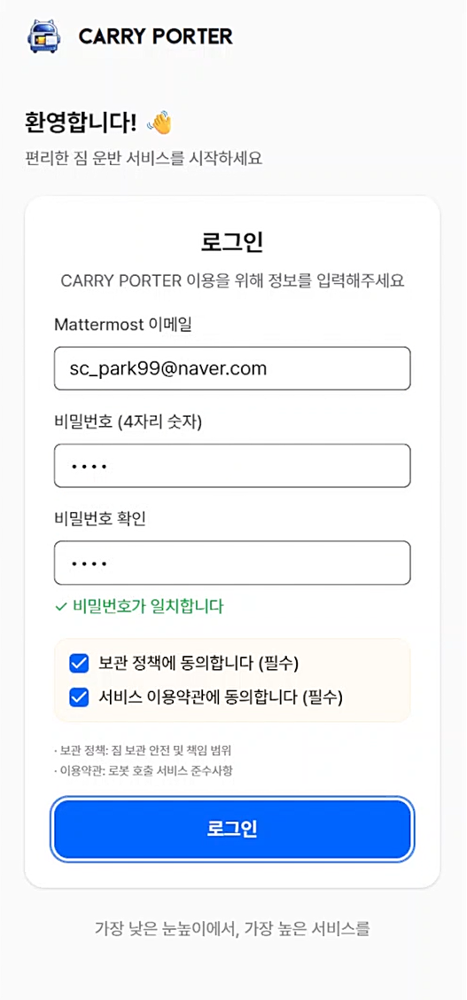

**인증번호 입력**

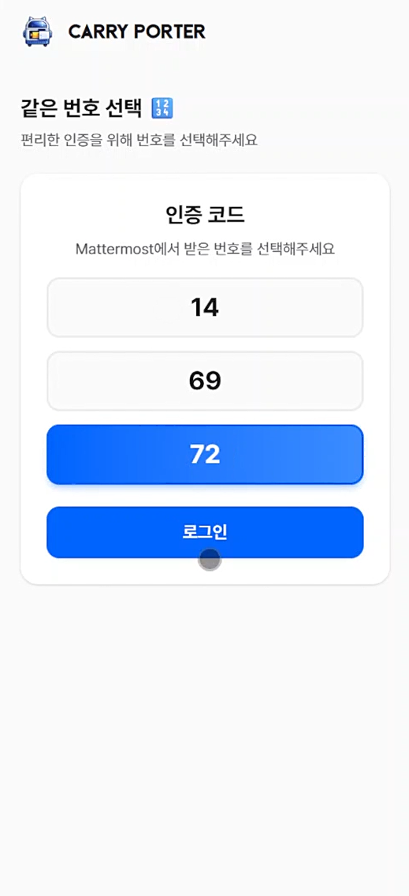

### 13.2 로봇 호출

**로봇 호출 버튼 클릭**

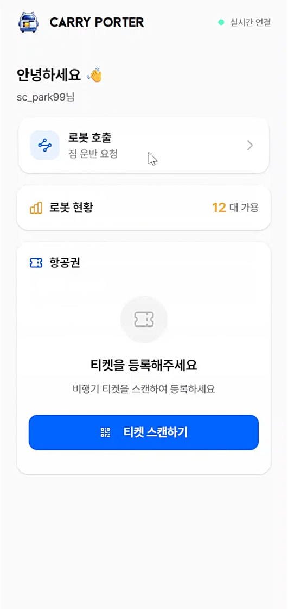

**호출 위치 클릭**

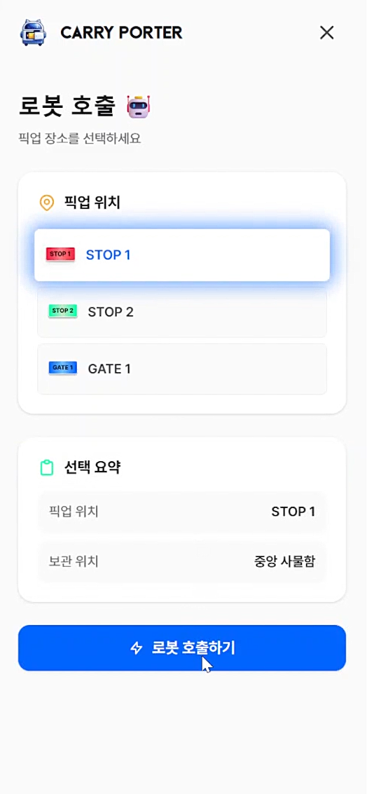

**로봇 배정 중**

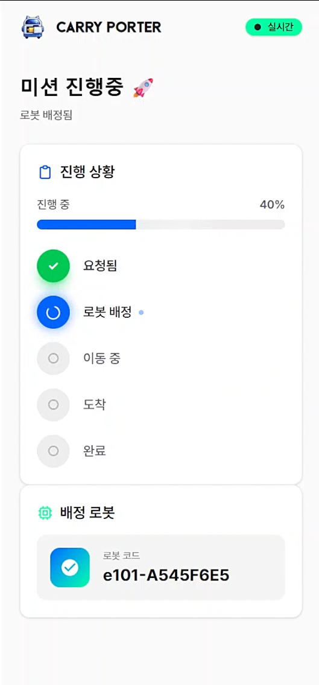

**로봇 이동 중**

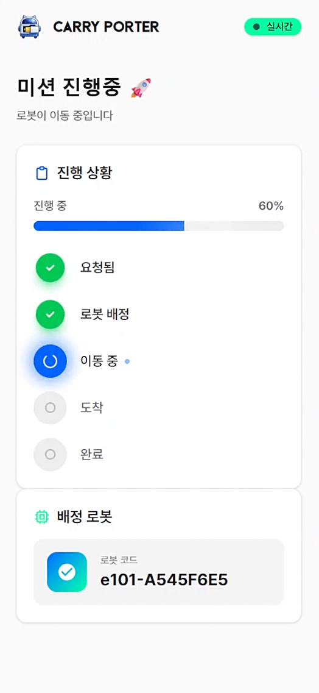

### 13.3 로봇에 짐 보관

**비밀번호 입력하여 로봇 잠금 해제**


**짐 보관 후 잠금**

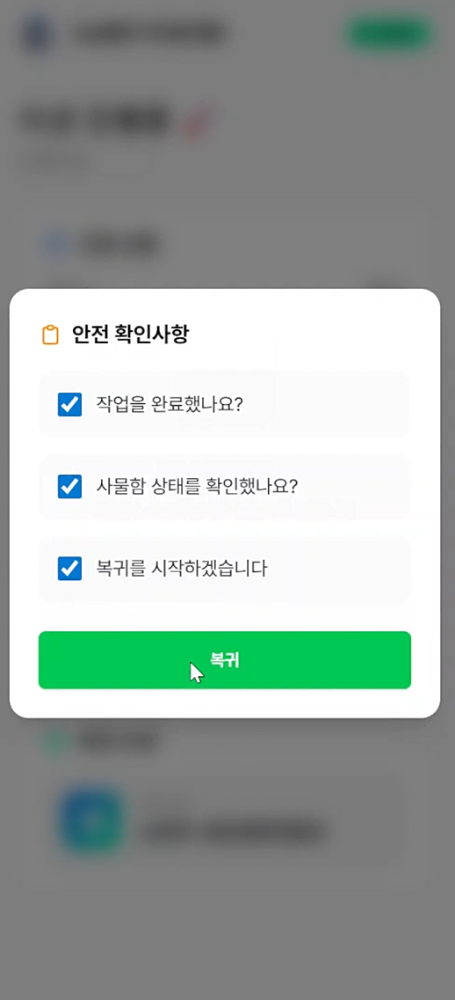

### 13.4 로봇 반납

**로봇 복귀 중**

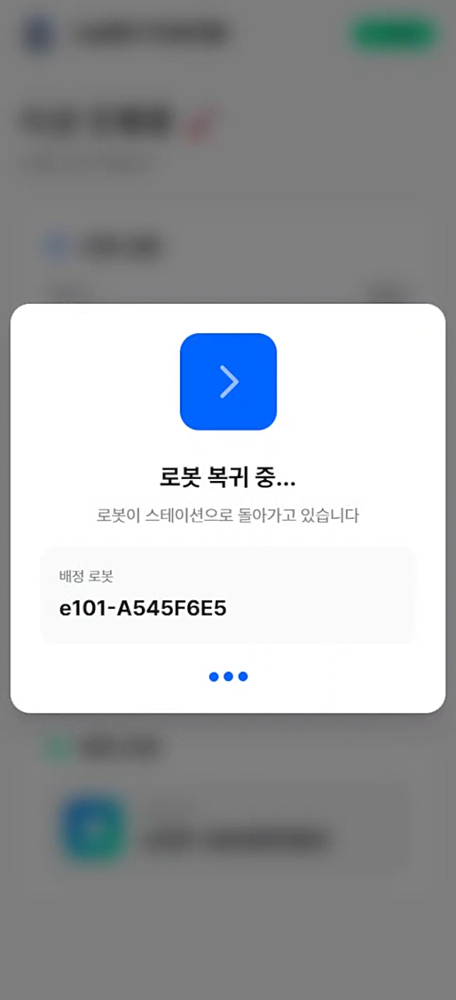

**복귀 확인**

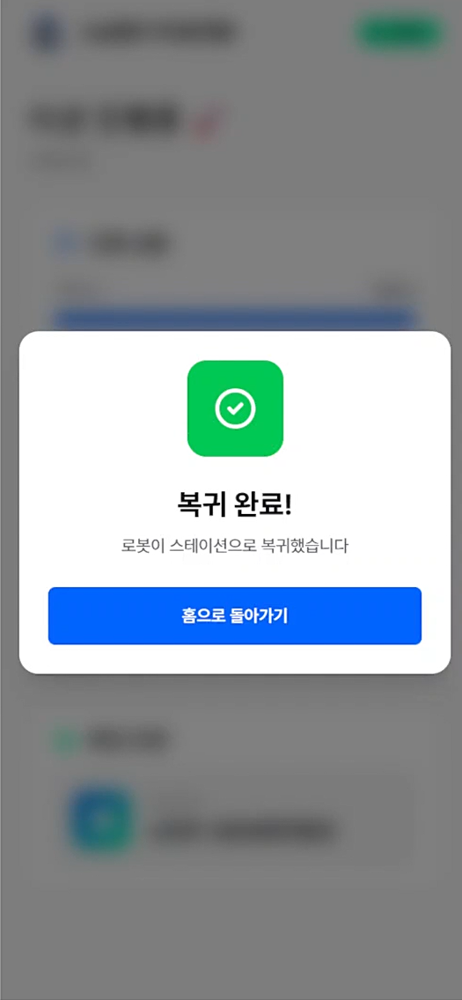

### 13.5 짐 찾기

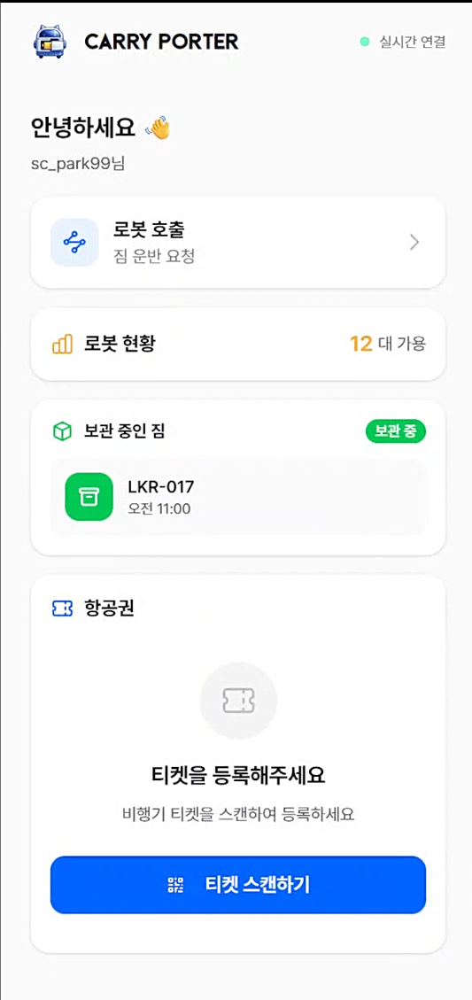

보관중인 짐이 있을 때 앞의 과정을 반복하면 짐 찾기 가능

## 관리자
### 13.6 사용자에게 로봇 보내기
**사물함 배정**

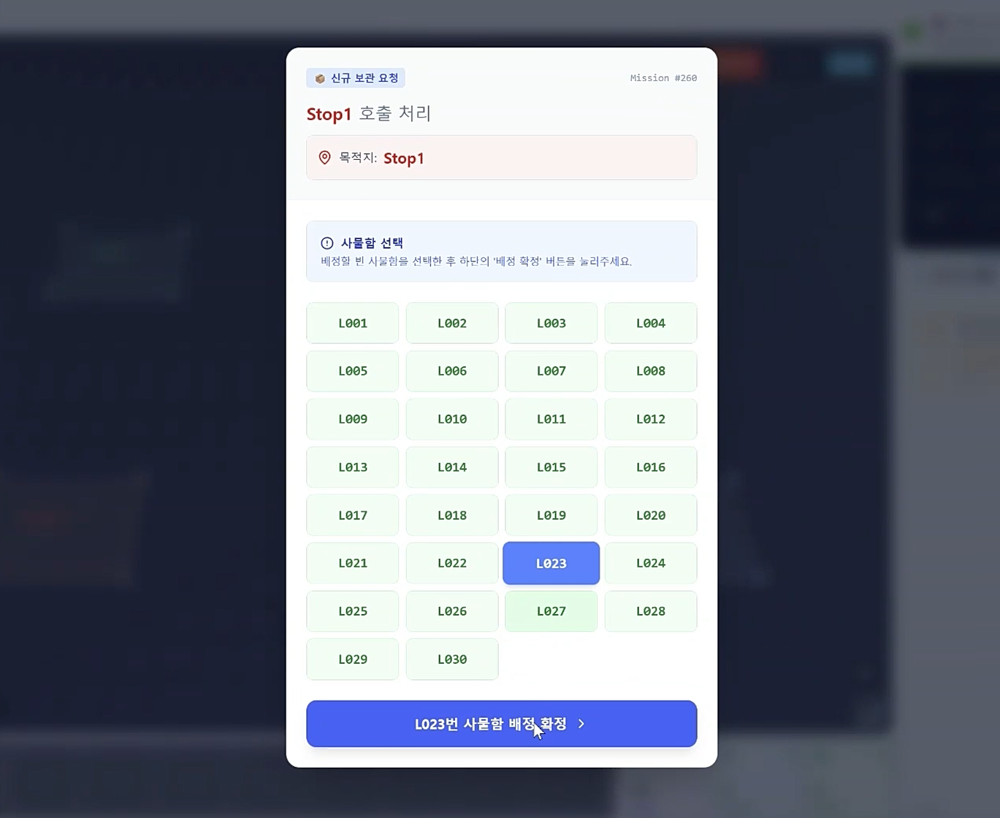

**로봇 보내기**

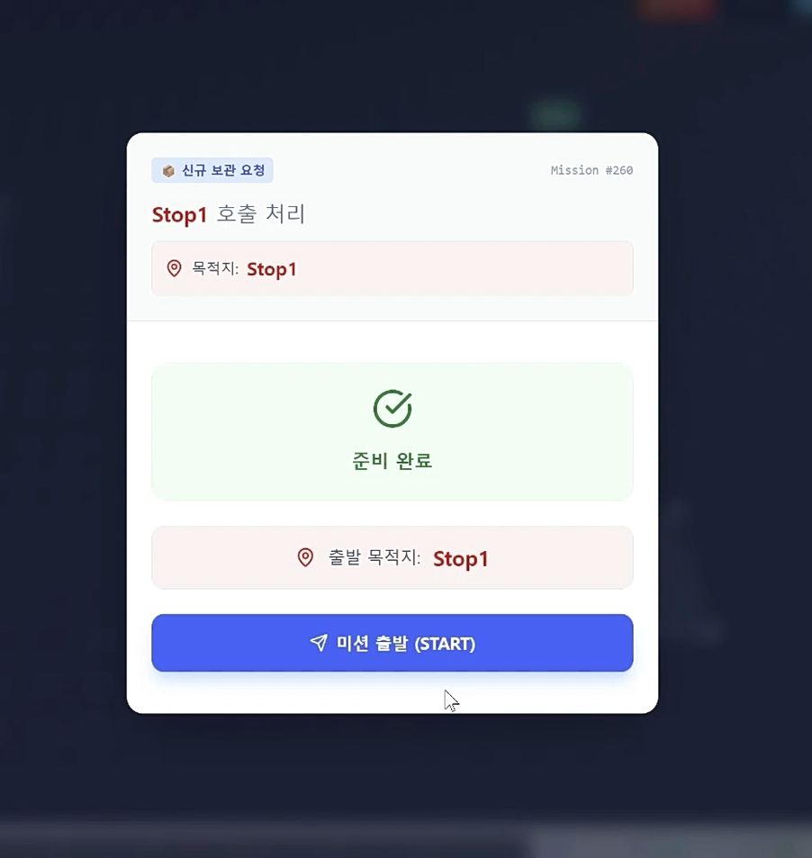

### 13.7 사용자 짐 보관

**로봇 잠금 해제**

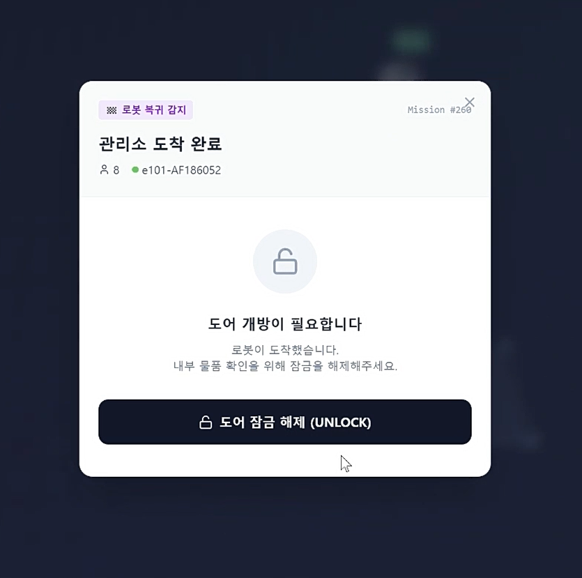

**짐 보관**


**로봇 충전소로 복귀**

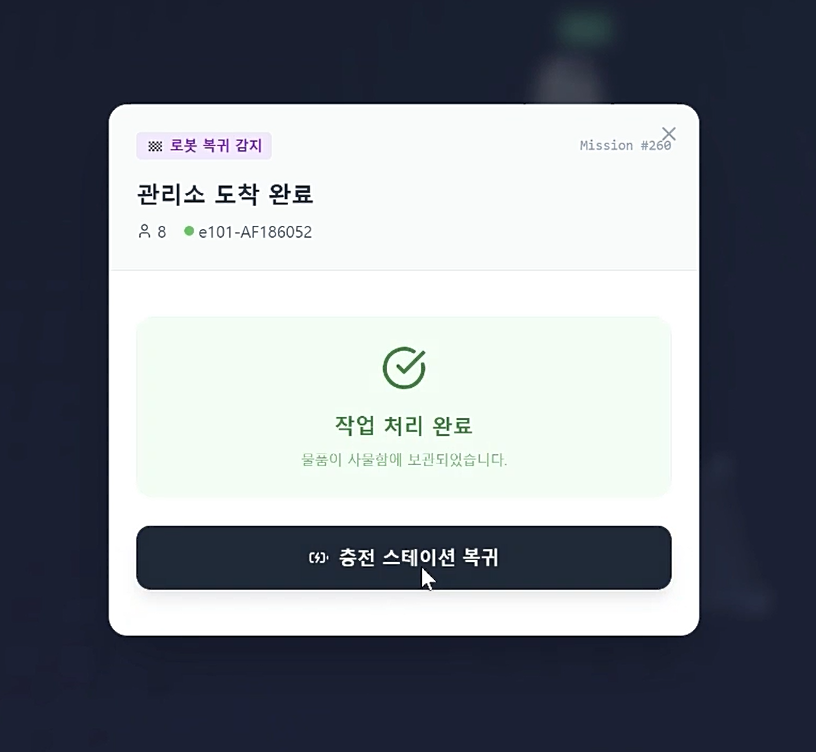

### 13.8 사용자 재호출

**사용자에게 로봇 보내기**
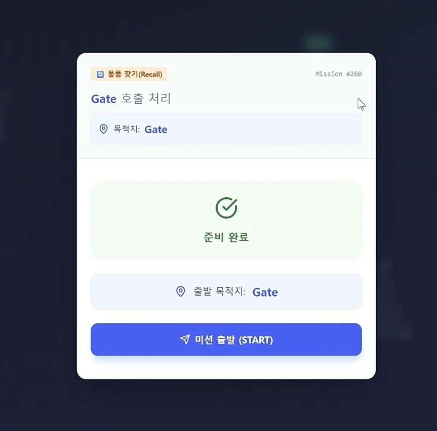

**로봇 반납(해당 미션에서 사용 끝)**
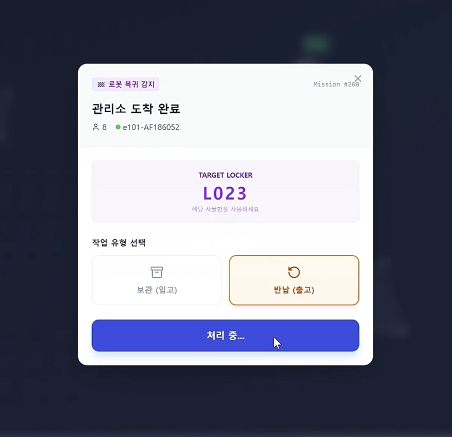